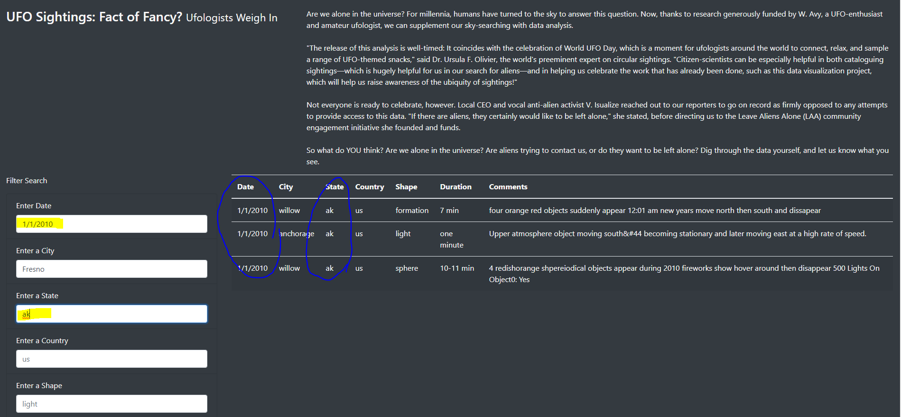
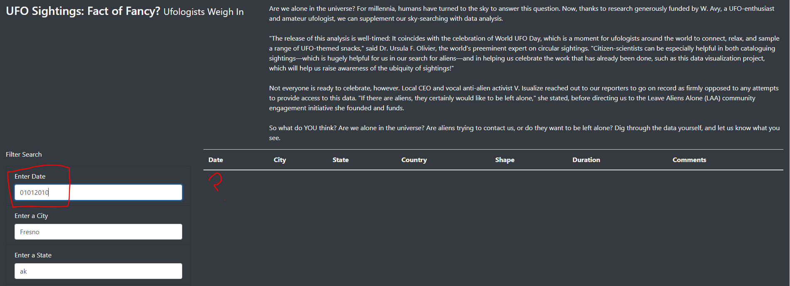

# UFO Analysis

### Overview
Dana is over the moon with her new assignment, she has the freedom to pursue a project where she is formatting data on UFO sightings in her hometown of McMinnville, OR.  Dana has been hooked on UFO sighting lore since hearing of Farmer Trent's UFO run-in back in 1950, and now, as a Data Journalist; she has the ability to craft her own website. She'll use a large javascript file of sightings data to create an easy to use website where users can filter tables and enjoy visuals and / or read articles on the sightings she has long enjoyed!

## Results

Dana and I were able to create a website that utilizes the results of her data gathering of UFO sightings in a table format.  She decided to place an article about UFOs front and center on the page to snatch in the bodies of her users.  And then in keeping with the theme of not wanting to alienate her core audience she used stark colors and clean lines for the other elements on the page.

Here you can see how the filters on the side can be used singularly or together to refine data; in the below example, the user searched for all instances of UFO activity reported for January 1, 2010 in Alaska:

## Summary

Dana has created a website the provides a the user the data she wanted to present in a clear format that is able to be filtered.

**Drawbacks**

	-If a user types in a ##/##/#### format in the search instead of a #/#/#### for the date, no search results are returned.  This may be misleading, and cause the user to think there are no results, rather than adjust the date format and try again.

**Recommendations**

	-It would be helpful if there was a parameter that allowed for users to search the comments section of the data.  This would allow for the user to see if they could find parallels to experiences, or correlate data if they wished to do so.

	-Currently, the website functionality doesn't allow for the search boxes to have old search data cleared unless the user clicks on the 'UFO Sightings' words in the upper left corner.  And there is no direction telling the user to do so, I only know this information, because I helped assist Dana in building her website.  It would be a cleaner and more user-friendly experience if the website design allowed for those fields to be cleared after each search.  (Yikes, I probably should have mentioned that to Dana, before we launched.  If she asks, I'll claim I was body snatched.)
